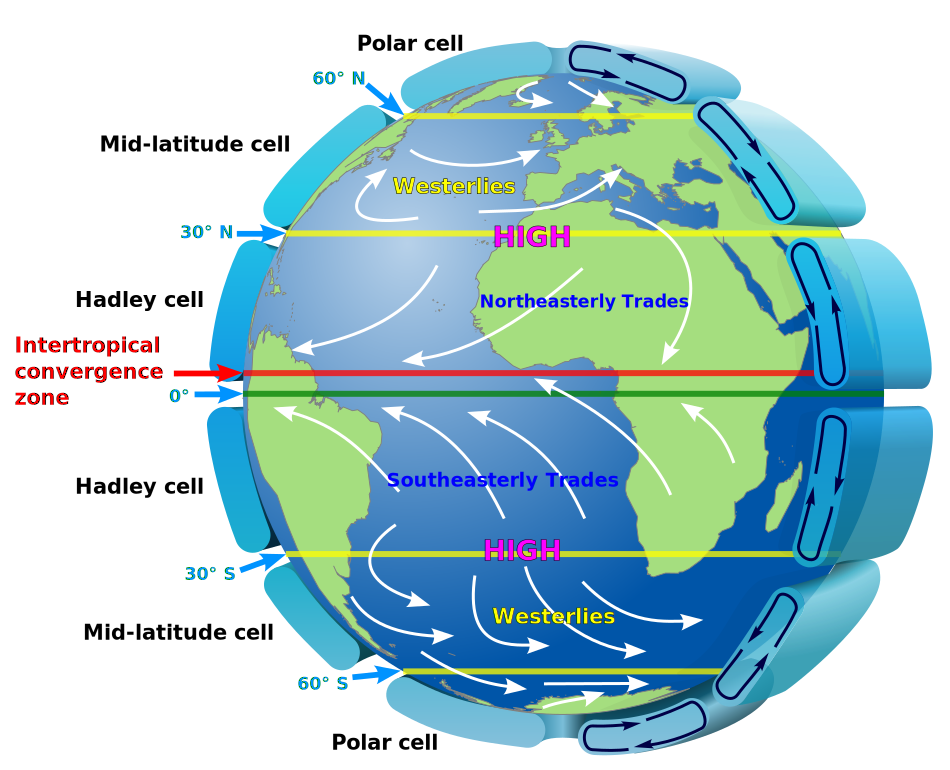

# Carbonate facies model
Emilia Jarochowska

# Motivation

In reconstructing past environments, we can use information preserved in
rocks. In sedimentary rocks, that information can be: sedimentary
structures, composition and sorting of mineral grains, fossils and their
preservation. But there is also important information in rock
characteristics that have a larger spatial scale than a single hand
sample: was this a long bed continuous over kilometers? Or a small patch
of lens of this rock surrounded by some other lithologies? Some
depositional environments are very diverse so they cannot be
reconstructed from a small rock fragment. We need to be aware of the
spatial scale of environmental processes we are reconstructing.

Where can we find this information? We can use the principle of
actualism and look at environments today. A small meandering river will
leave behind sediments which change in the composition and sorting over
the scale of a few meters. In the middle of the ocean, on a passive
continental margin, the sediment may not change much over tens or
hundreds of kilometers. In the former case, you may need a few hand
samples from different parts located at distances of a few meters of the
river bed to make a reconstruction. In the latter case, one sample is
quite representative for the range of grains and structures in this
environment.

*Revision question: what is the difference between sediment and rock?*

A diverse depositional environment can be split into smaller
sub-environments and the sediments which form there and which would
become rocks characteristic for this particular sub-environment.

**Facies: a group of rocks and primary structures indicative of a given
depositional environment.**

But how do we know what rocks and structures are indicative of what? We
make observations in modern environments and abstract them into a facies
model. A facies model maps sediments to sub-environments in which they
form. In the river example, it could be the sediment found at the delta,
in the middle of the bed, on a floodplain etc. We would note:

1.  What is the spatial scale of these structures?

2.  Where do they lie with respect to each other?

3.  What environmental conditions do they represent?

This way, when we study a fossil river in a geological outcrop, we can
estimate how far in space we need to go to find the direction of the
river, the breadth of the bed, and the distance from the delta.

# Objectives

After completing this exercise, the students can:

1.  Apply the principle of actualism in interpreting sedimentary rocks
2.  Name examples of facies and the environments they correspond to
3.  Observe the spatial scale of geological structures in a depositional
    environment using satellite imagery
4.  Describe sediments that are common in tropical carbonate platforms
    and link their characteristics to the environments in which they are
    observed today
5.  Explain what a facies model is
6.  Reflect on the scales of observation used in the practical (thin
    sections, hand samples), in the field and those visible in satellite
    images and what they can and cannot observe in hand samples
7.  Make a simple description of a carbonate thin section

# Constructing your own facies model

As an example in this exercise we will use tropical carbonate platforms.

**Carbonate platforms are marine structures built by in situ
(allochthonous) organisms producing calcium carbonate.**

Carbonate platforms often form prominent topography on the seafloor
because many organisms in them rely on photosynthesis to grow. So close
to the water surface, in the photic zone, a large amount of solar
radiation is available to them as a source of energy, allowing them to
grow very fast. The best known example of an environment in a carbonate
platform is a reef. But a carbonate platform contains not only reefs,
but also other environments, such as lagoons, slopes, tidal flats and
others.

In this exercise we focus on tropical carbonate platforms, because they
are easy to study and have many fossil counterparts. We’ll use the
Bahamas as an example.

## Spatial scale

Thanks to satellite imagery of Landsat and MODIS, we have photos of land
surface and shallow underwater environments in today’s Bahamas. These
satellite images are in the public domain and are used by Google Earth
and Google Maps to make their satellite view. Find the are depicted in
Figure 1 using Google Earth:

Figure 1. NASA image created by Jeff Schmaltz, MODIS Rapid Response
Team, Goddard Space Flight Center. Caption by Michon Scott.

Look at the global atmospheric circulation in Figure 2 and mark the
dominant wind direction over the Bahamas:

Figure 2. Idealised depiction of large-scale atmospheric circulation on
Earth. Author: Wikipedia user Kaidor, CC BY-SA 3.0.

Do you see any asymmetry in the topography and distribution of
environments in the Bahamas? How does it correspond to the wind
direction? On which side do you expect high wind energy and which part
of the platform is protected from the wind?

Now zoom in and out into the map and try to identify the following
environments. Save a view of the satellite image and label these
environments. You can have more than one environment on a view and you
can save multiple views.

1.  Windward side – a lot of wave energy
2.  Leeward side – protected from wave energy
3.  Patch reefs
4.  Reef crest (long ridge formed by reefs)
5.  Lagoon
6.  Tidal flat
7.  Tidal channel
8.  Sandy beach
9.  Marsh
10. Shoals and underwater dunes - submerged ridges, banks, or bars that
    are shaped by waves and currents
11. Tidal ponds

You can use additional explanations to the photos made by Landsat and
International Space Station, prepared at NASA:

https://earthobservatory.nasa.gov/images/86651/great-exuma-island-bahamas
for tidal channels
https://earthobservatory.nasa.gov/images/89060/little-bahama-bank for
reefs
https://earthobservatory.nasa.gov/images/146697/still-sandy-after-all-these-years
for underwater dunes

For each of these environments make a note how big, roughly, the spatial
scale is: 10 m? 100 m? 1 km? 10 km? And which environments occur next to
each other.

Looking at the view of the satellite photo you saved and labeled, try to
predict which environments will be calm and which ones will have high
wind or current energy.

## Types of sediment

We will use hand specimens, thin sections observed under a binocular
microscope and digital scans of thin sections.

For each hand sample and thin section, take a photo or make a sketch of
a representative fragment and make a description:

| Question                                                             | Answer |
|----------------------------------------------------------------------|--------|
| What type of rock is it?                                             |        |
| What is the texture?                                                 |        |
| What are the grains? Can you estimate what mineral they are made of? |        |
| How is the sorting?                                                  |        |
| What is the matrix?                                                  |        |
| What is it according to Dunham classification?                       |        |
| Have you recognized any organisms?                                   |        |
| In what environment would you expect to find it?                     |        |

## Facies model

Make a graphical sketch of an idealized carbonate platform with
different environments represented there. Mark: where the sea level is,
what environments you find above the sea level, within the range of the
tides, just below the sea level, in the photic zone, and deeper
downslope from it. Use your knowledge from analyzing satellite imagery
that the same environments may occur in several different contexts and
have different neighbors. Also one environmental parameter does not
always control the facies: in shallow water you can have different type
of sediment depending on wind intensity (and, therefore, wave energy),
water turbidity, salinity etc. You have full freedom in terms of
graphical expression, as long as others (students, teachers, future you)
can read it.

You can mark where the samples you described would fit in this model.
They may fit into more than one environment. Mark the scale of the major
structures on the model, using the observations you made on the Bahamas.

The purpose of this facies model is to help you interpret a fossil
carbonate platform next time you are in the field. Geological outcrops
are always limited and you will never be able to see the entire 3D body
of rock. Sometimes you have as little as a borehole. By knowing which
facies fit to what environments thanks to your model, you will be able
to reconstruct past environment from limited rock information.
